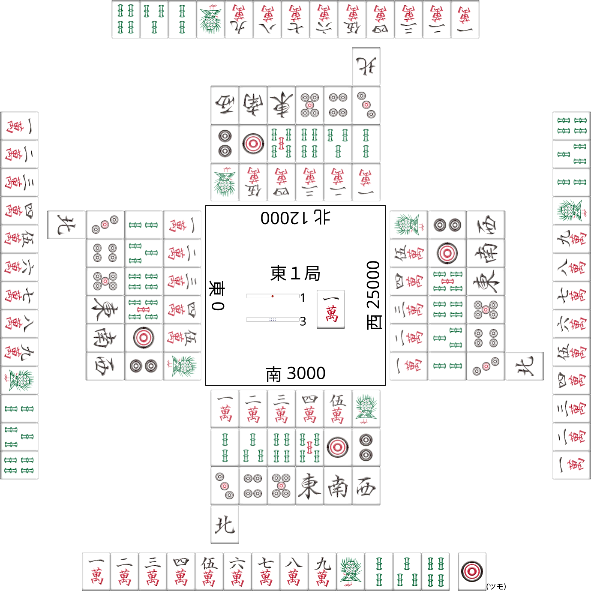

[](https://badge.fury.io/js/@konoui%2Fmjimage)

## 麻雀牌ジェネレーター

仕様に沿ってテキストを入力することで、SVG 形式の画像を生成する Typescript ライブラリです。

## 仕様

### 牌

| 牌     | 記述                                                    |
| ------ | ------------------------------------------------------- |
| 萬子牌 | 1m 2m 3m 4m 5m 6m 7m 8m 9m                              |
| 筒子牌 | 1p 2p 3p 4p 5p 6p 7p 8p 9p                              |
| 索子牌 | 1s 2s 3s 4s 5s 6s 7s 8s 9s                              |
| 風牌   | 1z(東) 2z(南) 3z(西) 4z(北) 1w(東) 2w(南) 3w(西) 4w(北) |
| 三元牌 | 5z(白) 6z(發) 7z(中) 1d(白) 2d(發) 3d(中)               |
| 赤ドラ | 0m 0p 0s 　                                             |
| 裏牌   | \_                                                      |

※ 風牌の w は wind の、三元牌の d は dragon の略

### 制御文字

| 記号 | 説明                                             | 記載例       |
| ---- | ------------------------------------------------ | ------------ |
| \-   | 横向きの牌を表す                                 | -123s        |
| ,    | ブロックの塊を表す区切り文字                     | 123s,-123s   |
| t    | ツモ牌を表す                                     | 123s,t3p     |
| d    | ドラ牌を表す                                     | 123s,t3p,d4p |
| r    | 赤ドラを示す（ 0m や 0p や 0s と同様に扱われる） | r5s          |
| ^    | ツモ切りを表す（牌の色が暗くなる）               | 3^56m        |

### 画像生成

#### 例 1）

```
456m456s456p1w2w3w1d,t2p,d3p
```


#### 例 2）

```
23789p, t1w, -456p, 9-99p, d3p
```


※ スペースは無視されます。

### 卓全体の生成

```yaml
table:
  1z:
    hand: 123456789m1234s
    discard: 12345m12345s12345p1234w
    score: 0
  2z:
    hand: 123456789m1234s,t1p
    discard: 12345m12345s12345p1234w
    score: 3000
  3z:
    hand: 123456789m1234s
    discard: 12345m12345s12345p1234w
    score: 25000
  4z:
    hand: 123456789m1234s
    discard: 12345m12345s12345p1234w
    score: 12000
  board:
    dora_indicators: 1m
    sticks:
      reach: 1
      dead: 3
    round: 1z1
    front: 2z
```



## 牌画像

[【保存版】商用無料の高クオリティーの麻雀画像の無料素材まとめ](https://majandofu.com/mahjong-images)

## 使い方

[Hugo 設定例](doc/configuration.md)

[html の例](example/index.html)

[CLI](./src/cmd/README.md)

## 開発

```
npm run build          # ライブラリを dist/ に生成する
npm run build:browser  # ブラウザ向け global.js と牌画像を dist-browser/ に生成する
npm run dev            # 開発サーバを起動する（http://localhost:5173/dev/）
npm run examples       # README の example を再生成する
npm test
```
